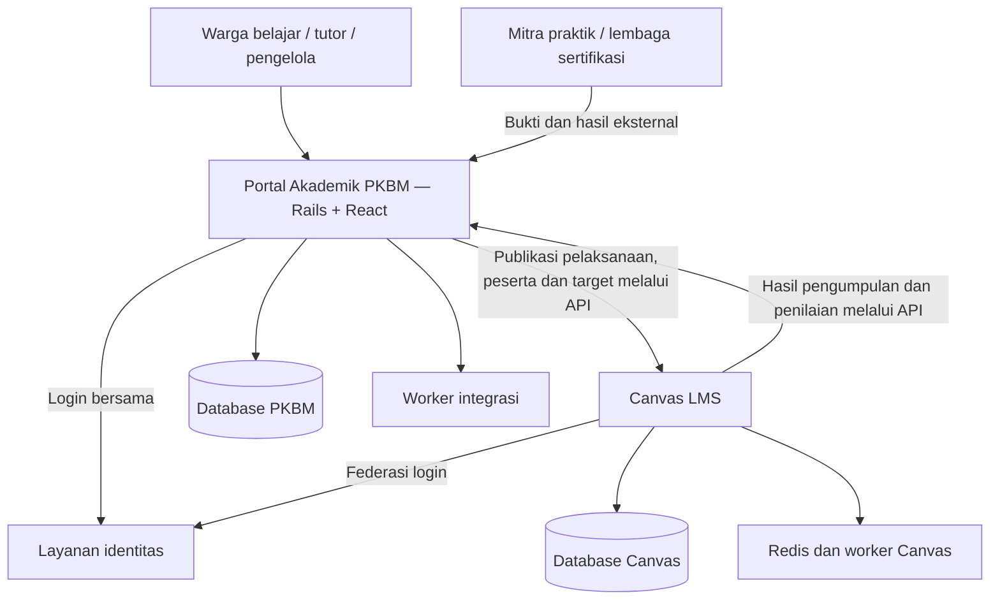

# Rangkuman sesi: arsitektur dan implementasi PKBM dengan Canvas LMS

> Dokumen ini adalah snapshot perancangan awal. Rancangan identitas/login diperbarui 7 Oktober 2026 pada [Tahap 5A — satu akun dan satu login](../tahap5a-arsitektur-identitas-dan-alur.md). Status implementasi terkini: [verifikasi Tahap 1–2](../tahap12-verifikasi.md) dan [catatan implementasi](../catatan-implementasi.md).

Tanggal: 7 Oktober 2026. Dokumen ini merekam keputusan dan hasil sesi sampai tahap perancangan; belum ada instalasi Canvas atau implementasi aplikasi/database.

## 1. Tujuan dan pelaku

Sistem mendukung PKBM menyelenggarakan Paket C, tutor/instruktur membimbing dan menilai, serta warga belajar menjalankan pembelajaran dan melihat hasilnya. Pembahasan mencakup pembelajaran, penilaian, capaian dan keputusan akademik, bukan sekadar penyimpanan PDF.

| Pelaku | Kebutuhan utama |
|---|---|
| Warga belajar | Rencana belajar, kegiatan berikutnya, bahan, pengumpulan bukti, umpan balik, perbaikan dan capaian |
| Tutor/instruktur | Perencanaan pembelajaran, pendampingan, penilaian bukti dan tindak lanjut per warga belajar |
| Pengelola PKBM | Pengelolaan program, kurikulum, kelompok, tutor, muatan khusus, rekap capaian dan keputusan akademik |
| Mitra/asesor | Bukti praktik, masukan kegiatan atau hasil sertifikasi sesuai kewenangan |

Canvas yang dimaksud adalah Canvas LMS dari Instructure, berbasis Ruby on Rails dengan antarmuka yang menggunakan React. Aplikasi pendamping PKBM direncanakan memakai Rails dan React juga.

## 2. Dasar akademik yang disepakati

**Kurikulum, silabus dan panduan muatan pemberdayaan/keterampilan menjadi dasar pemetaan, telaah dan struktur database.** Modul merupakan bahan/rangkaian pelaksanaan yang dipetakan ke acuan tersebut. Desain database dapat dilanjutkan tanpa menunggu semua modul tersedia.

```text
PKBM → Program Paket C → Versi kurikulum → Tingkatan V/VI
├── Umum dan peminatan
│   └── Mata pelajaran → silabus → KI/KD/indikator/materi/kegiatan
│       └── Koleksi modul → unit → kegiatan belajar
└── Muatan khusus
    ├── Pemberdayaan → panduan → capaian → rancangan kegiatan
    └── Keterampilan → panduan → program/kompetensi
        ├── Wajib: hubungan ke Seni Budaya, Olahraga/Rekreasi, Prakarya
        └── Pilihan: tersertifikasi atau nonsertifikasi
```

Kurikulum mencakup seluruh program Paket C. Silabus menguraikan mata pelajaran tertentu. Banyak modul dapat berada dalam satu mata pelajaran. Satu modul bisa terkait beberapa KD, dan satu KD dapat diperkuat beberapa modul. Modul tematik lintas mata pelajaran dapat dikembangkan melalui pemetaan eksplisit; contoh modul pengguna tetap mengikuti identitas mata pelajaran aslinya.

Panduan pemberdayaan dan keterampilan merupakan panduan penyelenggaraan yang membantu PKBM/tutor mengembangkan program sesuai kebutuhan, potensi dan kapasitas setempat. Keduanya bukan modul bernomor seperti modul mata pelajaran.

## 3. Arsitektur akademik dan pembelajaran (dilengkapi Tahap 5A)



| Tanggung jawab | Sistem utama |
|---|---|
| Acuan kurikulum, silabus, panduan dan kompetensi | Aplikasi PKBM |
| Katalog rancangan, rencana belajar, kelompok dan penugasan | Aplikasi PKBM |
| Course, materi, pengumpulan dan penilaian native | Canvas |
| Penilaian/bukti lokal atau mitra yang dicatat di pendamping | Aplikasi PKBM |
| Rekap capaian, keputusan akademik, SKK dan sertifikasi | Aplikasi PKBM |

Target pengguna adalah satu akun dan satu kali login melalui portal. Layanan identitas menyimpan credential utama; record portal/Canvas ditautkan ke identity yang sama, bukan dua akun yang diurus pengguna. Dukungan federasi, migrasi akun lama dan logout perlu diimplementasikan/dibuktikan pada Tahap 5A. Rancangan awal API/LTI saja belum memenuhi target ini.

Database Canvas mengikuti migrasi Canvas sendiri. Database akademik PKBM terpisah; integrasi memakai API dan dapat menampilkan layar pendamping melalui LTI. Integrasi tidak menulis langsung ke tabel Canvas.

Worker menyimpan pasangan ID lokal/Canvas, versi, waktu, status, error dan percobaan ulang. Sinkronisasi idempotent mencegah duplikasi. Koreksi nilai ditelusuri hingga capaian/keputusan yang terdampak dan tidak menghapus riwayat secara diam-diam.

### Pemetaan ke Canvas

| Objek PKBM | Objek Canvas yang direncanakan |
|---|---|
| PKBM | Account/sub-account sesuai jumlah lembaga |
| Pelaksanaan mata pelajaran/program | Course |
| Kelompok di dalam Course | Section |
| Urutan modul belajar | Canvas Modules |
| Unit dan kegiatan | Item, Pages, Files, Discussions, Assignments, Quizzes |
| Target dan penilaian | Outcomes dan rubrik |

Course merupakan ruang pelaksanaan suatu mata pelajaran atau program. Satu Course dapat memuat banyak modul. Katalog bahan/rancangan dipisahkan dari pelaksanaannya: bahan sama bisa dipakai banyak kelompok dengan hasil warga belajar yang tetap terpisah.

## 4. Sumber dan hasil pemetaan yang tersedia

Delapan sumber yang diberikan:

1. Kurikulum 2013 Pendidikan Kesetaraan Paket C.
2. Silabus Matematika Paket C.
3. Matematika Modul 1 — Belanja Cerdas.
4. Matematika Modul 2 — Memulai Bisnis.
5. Silabus Bahasa Indonesia Paket C.
6. Bahasa Indonesia Modul 1 — Menyingkap Ilmu Pengetahuan di Sekitar Kita.
7. Panduan Muatan Keterampilan.
8. Panduan Muatan Pemberdayaan.

Hasil yang sudah disusun: **register 8 sumber, 10 pemetaan bagian modul ke KD/indikator, dan 22 aturan**. Register memiliki jenis dokumen, cakupan, jumlah halaman fisik dan hash SHA-256; pemetaan dan aturan memiliki rujukan halaman PDF/cetak. Ini pemetaan contoh, bukan transkripsi seluruh KD dan modul Paket C.

| Modul | Hubungan materi dengan acuan |
|---|---|
| Matematika 1 | Landasan persamaan, pertidaksamaan/nilai mutlak dan rasional/irasional terkait KD 3.1/4.1 serta 3.2/4.2; hubungan bagian dua variabel ke 3.4/4.4 perlu telaah konsep |
| Matematika 2 | SPLTV: konteks, strategi, pemodelan dan penyelesaian terkait KD 3.3/4.3 |
| Bahasa Indonesia 1 | Unit 1 terkait 3.1/4.1; analisis dan penyusunan LHO pada Unit 2 terkait 3.2/4.2 |

Temuan yang dipertahankan:

- Belanja Cerdas menyebut pertidaksamaan dua variabel pada pengantar, tetapi bagian A/B membahas sistem persamaan. Materi persamaan tidak otomatis memenuhi KD pertidaksamaan.
- Silabus Matematika mencetak kode indikator berulang pada KD berbeda. ID database memakai konteks/UUID; kode sumber tetap disimpan.
- Silabus Bahasa Indonesia mencetak `4..1.2`; kode asli dan usulan normalisasi dipisahkan.
- Judul internal Bahasa Indonesia memakai “Menyingkap”, sementara nama file memakai “Menyingkapi”.
- Ketentuan yang belum dirinci sumber tetap kosong atau berstatus belum ditetapkan, tanpa angka/aturan yang dikarang.

## 5. Pembelajaran, penilaian dan hasil

Alur: kebutuhan/kondisi awal → rencana dan target → kegiatan → bukti → penilaian/umpan balik → perbaikan → capaian → keputusan akademik.

Progres aktivitas, nilai penilaian, capaian kompetensi, penyelesaian program, SKK dan sertifikasi adalah catatan berbeda. Klik selesai, waktu akses atau nilai kuis tidak otomatis menjadi capaian keterampilan atau pengakuan SKK.

| Lingkup | Aturan dari sumber yang perlu dijaga |
|---|---|
| Matematika 1 dan 2 | Kriteria pindah modul memiliki beberapa alternatif, termasuk tugas/latihan sesuai ketentuan atau tes penempatan minimal 75%; jalur dan bukti keputusan harus dicatat |
| Bahasa Indonesia Unit 1 | Skor maksimal 10, nilai skor × 10, minimal 70 untuk lanjut Unit 2 |
| Bahasa Indonesia Unit 2 | Bobot lima soal 2,2,4,1,1; nilai skor/10 × 100 |
| Bahasa Indonesia TAM | Nilai jawaban benar/jumlah soal × 100; kurang dari 70 diberi sekali lagi kesempatan mengulang |
| Bahasa Indonesia KD 3.2 | Analisis minimal dua teks; penilaian keterampilan menulis juga membutuhkan bukti produk yang sesuai |
| Pemberdayaan | Kondisi awal dan perkembangan pengetahuan, keterampilan serta sikap; penilaian partisipatif, observasi, wawancara, diskusi dan unjuk karya |
| Keterampilan | Teori/praktik dan rubrik sesuai kompetensi serta program; hasil sertifikasi eksternal terpisah dari hasil PKBM |

Tidak ada satu batas nilai atau aturan pengulangan global untuk semua mata pelajaran/program. Konflik jalur pada kriteria Matematika, formula nilai rekap dan tindak lanjut setelah pengulangan masih memerlukan ketentuan pelaksanaan.

### SKK dari tabel kurikulum

| Kelompok | Tingkatan V | Tingkatan VI | Total |
|---|---:|---:|---:|
| Umum | 26 | 14 | 40 |
| Peminatan | 30 | 15 | 45 |
| Khusus | 24 | 13 | 37 |
| Total | 80 | 42 | 122 |

Angka merupakan bobot kelompok, bukan per mata pelajaran atau modul. Satu SKK terkait 1 JP tatap muka/2 JP tutorial/3 JP mandiri atau kombinasi proporsional; JP Paket C 45 menit. Alokasi rinci dan keputusan pengakuan PKBM belum tersedia, sehingga sistem tidak membagi SKK rata atau mengesahkannya hanya dari durasi.

## 6. Struktur database pendamping

Rancangan logis sudah dibuat dengan kelompok tabel:

| Kelompok | Data |
|---|---|
| Acuan bersama | Dokumen/rujukan, versi kurikulum, tingkatan, kelompok, peminatan, komponen, silabus/panduan, KI/KD/indikator/capaian |
| PKBM dan peserta | Lembaga, orang, membership/peran, penawaran program, warga belajar, kelompok dan rencana belajar |
| Rancangan/pelaksanaan | Versi rancangan, komponen, kegiatan/target, pelaksanaan, tutor, pendaftaran, sesi dan partisipasi |
| Bahan belajar | Resource/modul, unit dan pemetaan ke target; kegiatan tidak wajib mempunyai modul PDF |
| Penilaian/hasil | Aturan/rubrik versi, instrumen, bukti/revisi, kontribusi, percobaan, hasil, baseline dan keputusan capaian |
| Akademik | Keputusan akademik, alokasi/pengakuan SKK, sertifikasi dan audit |
| Integrasi | Instance Canvas, pasangan ID, job dan log sinkronisasi |

Prinsip: UUID, FK dan pembatasan `pkbm_id`; kode sumber bukan kunci global; relasi banyak-ke-banyak untuk pemetaan; versi yang telah dipakai pada hasil dipertahankan; data yang tidak diketahui tetap null. Indikator lokal dibedakan dari indikator sumber.

## 7. Urutan implementasi yang disepakati

| Tahap | Hasil dan pemeriksaan |
|---|---|
| 1. Pemetaan sumber dan aturan | Dokumen/data pemetaan sudah tersedia; temuan dan parameter belum diketahui tercatat |
| 2. Kesiapan lingkungan dan Canvas lokal | Tentukan versi, lokasi penyimpanan, konfigurasi dan kapasitas; jalankan Canvas dengan peran dasar dan Course contoh |
| 3. Fondasi database PKBM | Implementasikan skema acuan, PKBM/peserta, rancangan dan pelaksanaan; data awal dari kurikulum/silabus/panduan |
| 4. Pembelajaran contoh | Matematika dengan dua modul dan Bahasa Indonesia dengan satu modul; jalankan belajar, pengumpulan, penilaian dan perbaikan |
| 5. Integrasi dan rekap | Publikasi peserta/pelaksanaan, sinkronisasi hasil, penelusuran bukti dan capaian lintas modul |
| 6. Muatan khusus | Satu program pemberdayaan dan satu keterampilan dengan bukti lapangan/praktik dan hasil mitra bila relevan |
| 7. Keputusan akademik/SKK | Aktifkan berdasarkan alokasi dan kebijakan PKBM yang ditetapkan; sertifikasi tetap mengikuti penerbit eksternal |
| 8. Uji coba operasional | Satu kelompok nyata; periksa akses, alur pengguna, integrasi, pencadangan dan pemulihan sebelum perluasan |

Fondasi database dapat dikerjakan sebelum Canvas berjalan. Integrasi memerlukan Canvas yang sudah siap. Tahap 2/3 dapat direncanakan bersamaan, tetapi keputusan ruang disk mendahului build pertama. Data seluruh modul tidak menjadi gerbang untuk memulai fondasi.

Contoh pertama harus menyelesaikan alur nyata: warga belajar membuka kegiatan Matematika 2, mengumpulkan jawaban, tutor menilai, warga belajar memperbaiki dan capaian tercatat. Nilai/capaian contoh tidak langsung mengesahkan SKK.

## 8. Pemeriksaan mesin pada sesi ini

Pemeriksaan baca saja berhasil dilakukan; tidak ada instalasi, pembersihan, pengunduhan image atau container baru.

| Komponen | Snapshot |
|---|---|
| OS | LMDE 7, basis Debian 13, x86_64 |
| CPU | AMD A8-7600, 4 core |
| RAM | Total 6,7 GiB; tersedia sekitar 3,1 GiB saat diperiksa |
| Swap | 1 GiB |
| Partisi root | Sisa sekitar 4,2 GB, terpakai 90% |
| Partisi home | Sisa sekitar 7,2 GB, terpakai 94% |
| Docker/Compose | Docker 26.1.5, daemon aktif; Compose 2.26.1 |
| Penyimpanan Docker | `/var/lib/docker`, berada pada root |
| Container | Empat tersimpan, semuanya berhenti saat diperiksa |
| Image lokal | Moodle, PostgreSQL, Node, Nginx; Canvas dan Redis belum tersedia |
| Cache build | Sekitar 6,9 GB pada `docker system df`; bukan jaminan ruang yang akan bebas jika dibersihkan |

Docker Compose direkomendasikan untuk lingkungan lokal. Root menjadi perhatian utama karena image/cache/volume Docker berada di sana; kode proyek berada di home. RAM dan CPU mendorong pelaksanaan bertahap, terutama saat kompilasi dan menjalankan pendamping.

**Koreksi estimasi:** 15–20 GB adalah perkiraan ruang kerja yang disarankan, bukan minimum resmi atau ukuran build terukur. Belum terbukti bahwa 4,2 GB pasti tidak cukup; ruangnya sempit untuk build pertama. Ukuran pasti memerlukan pilihan versi/config dan pengukuran image, volume dependensi, aset serta cache selama build. Web/worker dapat berbagi image, sehingga ukurannya tidak otomatis berlipat sesuai jumlah container.

## 9. Hasil tersimpan dan pekerjaan berikutnya

- `pemetaan-sumber-dan-aturan-pkbm.md`: pemetaan, ketentuan dan temuan dengan rujukan halaman.
- `pemetaan-sumber-dan-aturan-pkbm.json`: register sumber, 10 hubungan dan 22 aturan; bukan format impor Canvas.
- `struktur-database-akademik-pkbm.md`: rancangan logis tabel, relasi, integritas dan integrasi.
- Dokumen ini: rangkuman keputusan sesi.

Yang belum dilakukan: clone/pin versi Canvas, konfigurasi Compose proyek, build/install, migrasi/seed database, implementasi pendamping, Course, integrasi atau uji operasional.

Langkah berikutnya adalah menetapkan versi Canvas dan konfigurasi lokal, menentukan penanganan ruang disk, lalu membuat fondasi proyek dan migrasi database PKBM. Tidak ada izin pembersihan atau penghapusan data yang disimpulkan dari pemeriksaan kapasitas sebelumnya.
