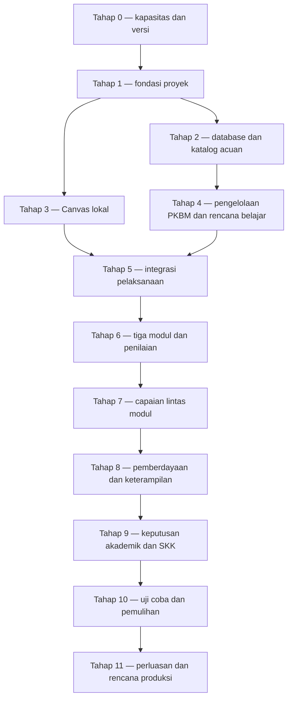

# Roadmap implementasi PKBM dan Canvas LMS

Tanggal: 7 Oktober 2026. Status terkini: Tahap 1–2 lulus lokal sesuai lingkup; Tahap 3 lulus lokal dengan checklist lengkap. Bukti: [verifikasi Tahap 1–2](../tahap12-verifikasi.md).

## 1. Sasaran dan acuan

Membangun lingkungan lokal yang memungkinkan PKBM menyiapkan program Paket C, tutor membimbing dan menilai, serta warga belajar mengikuti kegiatan, menerima umpan balik dan melihat capaian. Canvas menangani pembelajaran; aplikasi akademik PKBM menangani acuan, rencana dan keputusan akademik.

Roadmap mengikuti:

- [Pemetaan sumber dan aturan](./pemetaan-sumber-dan-aturan-pkbm.md), beserta [data JSON](./pemetaan-sumber-dan-aturan-pkbm.json).
- [Struktur database akademik](./struktur-database-akademik-pkbm.md).
- [Rangkuman keputusan sesi](./rangkuman-desain-dan-implementasi-pkbm-canvas.md).

Kurikulum, silabus, panduan pemberdayaan dan keterampilan merupakan acuan struktur. Modul menjadi bahan pelaksanaan. Katalog seluruh modul tidak menjadi prasyarat pembangunan fondasi. Parameter yang tidak tersedia dalam sumber tetap belum diisi sampai aturan pelaksanaan ditetapkan.

## 2. Aturan pelaksanaan roadmap

1. Kerjakan satu tahap dengan lingkup terukur. Mulai pekerjaan yang bergantung pada tahap sebelumnya setelah gerbangnya terpenuhi; pekerjaan mandiri boleh berjalan lebih awal.
2. Setiap tahap mencatat perubahan, bukti, masalah dan keputusan dalam catatan implementasi. Pisahkan bukti konfigurasi, database/API, browser, integrasi eksternal dan operasional.
3. Implementasi lokal dan kelayakan produksi adalah gerbang berbeda. Roadmap ini tidak mengizinkan deploy, migrasi layanan daring atau publikasi otomatis.
4. Database Canvas mengikuti versi dan migrasi Canvas. Aplikasi pendamping mempunyai database dan migrasi sendiri; integrasi melalui API/LTI.
5. Pertahankan container, volume dan data proyek lama. Pembersihan/pemindahan penyimpanan menjadi pekerjaan dengan sasaran eksplisit, setelah tindakan dan dampaknya ditetapkan.
6. Pemetaan bermasalah tetap tercatat. Sistem tidak mengubah kompetensi kurikulum agar sesuai dengan isi modul yang berbeda konsep.

## 3. Dependensi dan urutan

Tahap 2 dapat dikerjakan sementara runtime Canvas disiapkan. Integrasi dan pembelajaran baru bergantung pada Canvas yang berfungsi. Pemilihan program muatan khusus dan perumusan kebijakan lokal dapat dilakukan lebih awal untuk mengurangi ketergantungan tahap akhir.

## 4. Tahap 0 — kapasitas mesin, versi dan keputusan penyimpanan

**Tujuan:** memperoleh rencana setup yang dapat dijalankan tanpa menghabiskan disk atau mengganggu proyek lama.

Snapshot sesi: RAM 6,7 GiB, CPU 4 core, root kosong sekitar 4,2 GB, home 7,2 GB, Docker aktif dan menyimpan data di `/var/lib/docker`. Nilai ini perlu dicek ulang sebelum build. Canvas dan Redis belum tersedia saat pemeriksaan terakhir.

Pekerjaan:

- [x] Periksa ulang kapasitas, container, image, volume, cache dan port.
- [x] Pilih release/tag atau commit Canvas yang eksplisit; catat versi Ruby, Node, PostgreSQL dan Redis yang sesuai sumber versi tersebut.
- [x] Tentukan mode lokal yang digunakan, layanan wajib dan proses kompilasi aset; hindari menjalankan seluruh alat pengembangan yang belum diperlukan.
- [x] Tetapkan kebutuhan unduhan dan lokasi kode, dependensi, cache, database serta unggahan.
- [x] Putuskan tindakan kapasitas: ruang tambahan, penyimpanan alternatif atau pembersihan cache dengan sasaran jelas. Jangan menganggap pemindahan root Docker ke home otomatis menyelesaikan kapasitas, karena home juga terbatas.
- [x] Catat port yang tersedia dan rencana penggunaan satu endpoint lokal Canvas dan satu pendamping.

**Hasil:** catatan versi, konfigurasi yang dipilih, rencana kapasitas dan daftar layanan.

**Gerbang:** versi/dependensi dan lokasi data diketahui; build pertama memiliki ruang kerja yang dinilai cukup berdasarkan konfigurasi. Estimasi 15–20 GB dari sesi bukan minimum resmi atau hasil pengukuran. Jika ruang belum memadai, lanjut pekerjaan desain/skema yang tidak membutuhkan build; gerbang runtime tetap terbuka.

Catatan pelaksanaan: [Tahap 0](./catatan-implementasi-pkbm-canvas.md). Pemeriksaan terbaru: root tersedia 12 GiB, home 17 GiB. Konfigurasi awal dipilih; build tetap bersyarat pada pengukuran disk dan pencatatan patch/digest image. Belum ada runtime Canvas.

## 5. Tahap 1 — fondasi proyek dan konfigurasi

**Tujuan:** repositori dan konfigurasi yang dapat dijalankan ulang.

**Arti checklist:** `[x]` berarti bukti memenuhi lingkup butir tersebut. Untuk butir membuat/menyediakan, inspeksi file dapat membuktikan ketersediaan; itu tidak membuktikan seluruh perilaku runtime. Butir gabungan tetap `[ ]` jika sebagian tuntutannya belum dibuktikan. Bukti historis tercatat di catatan implementasi; pembuktian terbaru dijalankan pada 7 Oktober 2026 dan dicatat dalam laporan verifikasi.

- [x] Tetapkan direktori implementasi dan repositori Canvas pada versi terpilih, serta aplikasi PKBM terpisah.
- [x] Buat `AGENTS.md` untuk lingkup tahap, batas akses, aturan data dan validasi; simpan catatan implementasi yang berubah di `docs/`.
- [x] Simpan roadmap, pemetaan dan rancangan database sebagai dokumen acuan proyek dengan rujukan yang konsisten. Tautan lokal, manifest, rujukan sumber dan penanda status historis diperiksa; bukti tercatat pada laporan verifikasi.
- [x] Siapkan Compose berlingkup proyek, konfigurasi lokal, contoh environment tanpa secret, volume persisten dan jaringan internal.
- [x] Pisahkan database Canvas dan PKBM secara logis; proses PostgreSQL boleh berbagi layanan jika kompatibel dan dipilih untuk menghemat sumber daya. Gunakan user/hak akses terpisah. Redis mengikuti kebutuhan Canvas; antrean pendamping dipilih tersendiri.
- [x] Sediakan perintah singkat untuk start, stop, log, migrasi dan seed; dokumentasikan penyimpanan yang harus dipertahankan.

Pada snapshot Tahap 1, `sync` masih guard. Tahap 5 kini menyediakan runner/worker opsional; koneksi nyata sudah diuji lokal. [Status Tahap 5](../tahap5-status.json).

**Hasil:** fondasi source/config dan panduan menjalankan lokal.

**Gerbang:** konfigurasi Compose valid, nama/volume/port tidak bertabrakan dan secret tidak masuk repositori. Gerbang ini adalah bukti konfigurasi, belum bukti aplikasi berjalan.

Status terbaru Tahap 1: **Lulus lokal fondasi**. Konfigurasi, pemisahan akses database, source pin dan rujukan diperiksa. Penyediaan wrapper tidak berarti setiap kombinasi argumennya diuji. Implementasi sinkronisasi Tahap 5 tersedia; gerbang integrasinya lulus lokal, lihat verifikasi Tahap 5. Bukti: [verifikasi Tahap 1–2](../tahap12-verifikasi.md).

## 6. Tahap 2 — migrasi database dan katalog acuan

**Tujuan:** struktur akademik tersedia terpisah dari bahan dan pelaksanaan.

- [x] Implementasikan tabel sumber, rujukan, versi kurikulum, tingkatan, kelompok, peminatan, komponen, acuan, target KI/KD/indikator, materi dan kegiatan sumber.
- [x] Implementasikan hubungan komponen keterampilan wajib ke mapel/KD asal serta register temuan.
- [x] Terapkan UUID/FK, keunikan dalam konteks dan struktur versi; kode indikator berulang tidak menjadi kunci global. Bukti uji dan telaah sumber dicatat pada laporan verifikasi.
- [x] Seed delapan sumber dan struktur Paket C V/VI. Simpan 26/14 SKK umum, 30/15 peminatan, 24/13 khusus sebagai bobot kelompok.
- [x] Seed semua mata pelajaran/komponen yang disebut acuan; bedakan Matematika wajib/peminatan dan Sejarah Indonesia/peminatan. Bukti uji dan telaah sumber dicatat pada laporan verifikasi.
- [x] Seed KI/KD Matematika dan Bahasa Indonesia Tingkatan V yang dibutuhkan tiga modul contoh; indikator mengikuti silabus terkait. Bukti uji dan telaah sumber dicatat pada laporan verifikasi.
- [x] Seed area/capaian Paket C dari panduan pemberdayaan dan struktur keterampilan wajib/pilihan. Jangan membuat kode KD nasional untuk capaian panduan tanpa kode. Bukti uji dan telaah sumber dicatat pada laporan verifikasi.
- [x] Import pemetaan contoh dan temuan, termasuk perbedaan persamaan/pertidaksamaan serta kode salah cetak. Bukti uji dan telaah sumber dicatat pada laporan verifikasi.
- [x] Tambahkan tampilan/API baca katalog dan status cakupan; mapel belum lengkap ditandai jelas. API `/api/v1/catalog` sudah berjalan dan diperiksa HTTP 200 pada penyelesaian Tahap 3.

- [x] Buktikan seed dapat diulang tanpa duplikasi. Migrasi/seed SQL dan Rails dijalankan ulang; jumlah dan hash isi seluruh 20 koleksi tetap sama. Database baru menghasilkan katalog yang sama.

**Hasil yang sudah terbukti:** migrasi database baru, pengulangan seed, penolakan kasus invalid, seluruh koleksi API, identitas delapan PDF dan telaah isi katalog contoh. SKK tetap bobot kelompok; alokasi per mapel belum ditetapkan.

**Gerbang:** migrasi bekerja pada database lokal baru; seed dapat diulang tanpa duplikasi; referensi sumber/tingkatan/mapel benar; angka SKK tidak dibagi rata atau dihitung ganda. Semua KD Paket C belum harus menjadi seed pada tahap ini.

Status terbaru Tahap 2: **Lulus lokal katalog contoh**. 62 pemeriksaan database/API lulus, disertai pemeriksaan integritas register dan telaah halaman sumber. Seluruh KD nasional dan pengesahan akademik oleh tutor/PKBM berada di luar lingkup ini; temuan MAP-04 tetap terbuka. Bukti: [verifikasi Tahap 1–2](../tahap12-verifikasi.md).

## 7. Tahap 3 — Canvas lokal berfungsi

**Tujuan:** runtime Canvas tersedia untuk pembelajaran contoh.

- [x] Build/siapkan image dan dependensi sesuai versi yang dipilih; catat disk sebelum/sesudah image, dependensi dan aset.
- [x] Jalankan inisialisasi database, aset dan layanan web/worker/Redis sesuai kebutuhan versi.
- [x] Siapkan satu account/sub-account PKBM, akun pengelola, tutor dan warga belajar contoh.
- [x] Periksa login, kewenangan dasar, pembuatan Course dan unggahan berkas.
- [x] Periksa job latar belakang dan persistensi data setelah restart normal.
- [x] Catat RAM/disk saat idle dan saat operasi contoh; pisahkan dari kemampuan menampung banyak pengguna. Tiga sampel idle dan dua belas sampel operasi direkam; rincian dan batas ukur pada [laporan](../tahap3-pengukuran.md).
- [x] Buktikan pemilihan berkas dan unggahan selesai melalui browser. Tampilan Files lama: pemilih berkas berhasil, toast sukses dan baris berkas terlihat; unduhan cocok byte dengan fixture. New Files Page juga berhasil menurut pengujian manual pengguna. [Bukti](../tahap3-unggahan-browser.json).

**Hasil:** satu Canvas lokal yang dapat digunakan pada endpoint yang ditetapkan.

**Gerbang:** UI login dan Course dapat digunakan di browser, proses dasar/jobs berfungsi, data bertahan restart. HTTP 200 saja tidak memenuhi gerbang ini. Kinerja kelompok nyata belum disimpulkan.

Status 7 Oktober 2026: **Lulus lokal; checklist Tahap 3 lengkap**. Bukti fungsi dasar terdahulu dilengkapi pengukuran idle/operasi serta unggahan browser melalui tampilan Files lama, dengan hasil unduhan cocok byte. New Files Page berhasil menurut pengujian manual pengguna; otomatisasi picker pada tampilan baru masih timeout; tidak ada klaim kapasitas kelas nyata atau lulus produksi. [Pengukuran](../tahap3-pengukuran.md), [unggahan](../tahap3-unggahan-browser.json).

## 8. Tahap 4 — pengelolaan PKBM dan rencana belajar

**Tujuan:** pelaku, rancangan dan pelaksanaan dapat dikelola pendamping.

- [x] Implementasikan PKBM, orang/membership/peran, program, learner_program, kelompok dan penugasan.
- [x] Implementasikan rancangan versi, komponen, kegiatan/target, pelaksanaan, peserta, rencana belajar dan sesi.
- [x] Sediakan UI pengelola untuk memilih acuan, membuat kelompok, menetapkan tutor dan peserta.
- [x] Sediakan UI tutor untuk memilih target dan menyusun kegiatan/bukti penilaian sesuai silabus/panduan.
- [x] Sediakan UI warga belajar untuk melihat rencana yang berlaku dan pendampingnya.
- [x] Catat penyesuaian lokal sebagai rancangan tutor/PKBM terpisah dari sumber.

**Hasil:** program dan pelaksanaan dapat disiapkan tanpa duplikasi pencatatan manual pada dua sistem.

**Gerbang:** batas PKBM dan peran diuji pada API; warga belajar hanya mengakses data sendiri, tutor sesuai penugasan; alur dasar terlihat berfungsi di browser. Gunakan fixture dua PKBM untuk memeriksa pembatasan meskipun pilot hanya satu PKBM.

Status pelaksanaan 7 Oktober 2026: **Lulus lokal: API diuji agen, alur dasar browser dikonfirmasi manual pengguna**. 483 pemeriksaan API lulus, termasuk isolasi tenant/peran dan penugasan tutor; celah item rencana diperbaiki. Bukti browser berasal dari laporan manual pengguna; tidak diklaim sebagai pengujian otomatis semua formulir oleh agen. [Validasi API](../tahap4-api-verifikasi.md), [lingkup](../tahap4-implementasi.md).

## 9. Tahap 5 — integrasi pelaksanaan dan identitas Canvas

**Tujuan:** rancangan dan peserta pendamping terhubung dengan Course Canvas.

- [x] Implementasikan instance/binding, otorisasi API, penyimpanan token yang terlindungi dan job sinkronisasi.
- [x] Sinkronkan account/course/section/user/enrollment berdasarkan sumber utama yang ditetapkan.
- [x] Publikasikan target menjadi Outcomes dan catat hubungan ID, termasuk keterbatasan versi Canvas yang ditemukan.
- [x] Publikasikan materi/kegiatan yang dipilih serta tautannya; jangan menerbitkan pemetaan bermasalah sebagai klaim cakupan penuh.
- [x] Sediakan status job, error, retry, rekonsiliasi dan pencatatan konflik.
- [x] Tambahkan akses LTI ke layar pendamping setelah API dasar berjalan; pemeriksaan identitas/lingkup tetap diterapkan.

**Hasil:** pelaksanaan dibuat/diperbarui melalui proses yang terlacak.

**Gerbang:** sinkronisasi ulang tidak menggandakan objek; update dan kegagalan parsial dapat dipulihkan; binding dua sistem benar. Uji koneksi nyata ke Canvas lokal, bukan mock saja.

Status pelaksanaan 7 Oktober 2026: **Lulus lokal, 130 pemeriksaan akhir lulus, 0 gagal**. Koneksi dua PKBM ke Canvas, pengulangan tanpa duplikasi, update/roster, binding, konflik/retry, pemulihan parsial terkontrol dan launch Canvas bertanda tangan melalui HTTP terbukti. UI status diperiksa; seluruh navigasi/formulir browser tidak diklaim. Token sementara dicabut dan salinannya dibersihkan. Worker daemon tidak dimulai; runner satu job diuji. [Bukti dan batas](../tahap5-verifikasi.md), [status](../tahap5-status.json).

## Tahap 5A — satu identitas dan login bersama (SSO)

Kebutuhan ini ditambahkan setelah warga belajar mengalami akses ditolak saat membuka Course Canvas dengan akun demo lama. Akun pendamping dan Canvas sekarang terpisah; sinkronisasi membuat akun Canvas lain, tetapi login pengguna belum disediakan. LTI Canvas → pendamping yang diuji pada Tahap 5 bukan SSO pendamping → Canvas. Status Lulus lokal Tahap 5 tetap hanya untuk lingkup pengujian integrasi yang tercatat.

- [ ] Tetapkan penyedia identitas bersama dan alur login kedua aplikasi.
- [ ] Petakan satu identitas pengguna ke PKBM, peran dan akun Canvas yang benar.
- [ ] Tangani akun demo lama/hasil sinkronisasi tanpa menggandakan pengguna atau membuka akses lintas PKBM.
- [ ] Sediakan satu kali login dan alur keluar yang jelas.
- [ ] Buktikan perpindahan pendamping → Canvas dan Canvas → pendamping melalui browser WB/tutor/pengelola.

**Gerbang:** pengguna dapat masuk sekali dan membuka pembelajaran sesuai PKBM/peran. Implementasi belum dimulai. Penyelesaian alur pengguna Tahap 6 bergantung pada tahap ini; kode Tahap 6 yang sudah ditulis dipertahankan.

## 10. Tahap 6 — tiga modul dan alur penilaian lengkap

**Tujuan:** satu alur belajar sampai penilaian/perbaikan berjalan end-to-end.

- [ ] Implementasikan katalog resource/unit, pemetaan target, rencana penilaian, aturan versi dan rubrik.
- [ ] Buat Course Matematika Tingkatan V dengan Belanja Cerdas dan Memulai Bisnis; Course Bahasa Indonesia dengan modul LHO.
- [ ] Susun unit, bahan, kegiatan, latihan, penugasan dan uji sesuai sumber; bedakan latihan mandiri dengan uji formal.
- [ ] Matematika: modelkan jalur alternatif kriteria pindah modul dan pemeriksaan prosedur oleh tutor. Tentukan denominator/rubrik pelaksanaan yang belum dirinci sumber.
- [ ] Bahasa Indonesia: terapkan bobot/nilai Unit 1/2 dan aturan TAM, termasuk sekali kesempatan mengulang; tentukan kebijakan rekap yang belum ditetapkan.
- [ ] Siapkan bukti analisis minimal dua teks dan produk/revisi LHO; skor pilihan ganda tidak menggantikan bukti menulis.
- [ ] Rekam pengumpulan, percobaan, revisi, penilai, umpan balik dan tindak lanjut.
- [ ] Simpan MAP-04 MTK1 sebagai temuan. Jika ingin menilai KD pertidaksamaan dua variabel, sediakan kegiatan/bukti yang benar-benar sesuai.

**Hasil:** warga belajar dapat belajar, mengumpulkan, menerima umpan balik dan memperbaiki; tutor dapat menilai bukti sesuai target.

**Gerbang:** alur browser warga belajar dan tutor lengkap, perhitungan nilai cocok contoh, batas percobaan sesuai lingkup, hasil penilaian dapat ditelusuri. Selesai modul belum berarti SKK disahkan.

Status pelaksanaan 7 Oktober 2026: **implementasi tersedia; gerbang belum diuji/lulus**. Migrasi dan draf tiga modul untuk dua PKBM terpasang. Versi/rubrik, publisher Canvas, bridge bukti/penilaian, prasyarat pelepasan tutor, TAM/ulangan dan UI ditulis. Draf belum ditelaah/terbit dan token API saat ini tidak tersedia. Course/objek baru belum dibuat nyata. Checklist tetap terbuka sampai bukti tersedia. [Lingkup](../tahap6-implementasi.md), [status](../tahap6-status.json).

## 11. Tahap 7 — rekap capaian lintas modul

**Tujuan:** menggabungkan bukti untuk target akademik tanpa kehilangan asalnya.

- [ ] Tarik hasil native Canvas dan gabungkan dengan hasil lokal yang relevan, tanpa menimpa sumber utama.
- [ ] Implementasikan keputusan capaian beserta dasar bukti, aturan, pengambil keputusan dan riwayat.
- [ ] Sediakan rekap per warga belajar, kompetensi dan mata pelajaran; tampilkan progres, skor dan capaian terpisah.
- [ ] Sediakan daftar tutor untuk target belum tercapai dan kebutuhan pendampingan.
- [ ] Tangani perubahan nilai/pemetaan dengan peninjauan keputusan terdampak.

**Hasil:** tutor/PKBM bisa membaca perkembangan lintas modul, warga belajar tahu yang dicapai dan perlu diperbaiki.

**Gerbang:** setiap capaian dapat dibuka sampai bukti dan penilaian; duplikasi hasil tidak menggandakan capaian; hasil koreksi/percobaan tetap terlacak. Rumus agregasi menggunakan kebijakan yang ditetapkan, bukan otomatis rata-rata.

## 12. Tahap 8 — muatan pemberdayaan dan keterampilan

**Tujuan:** sistem melayani seluruh jenis muatan utama, termasuk kegiatan di luar layar.

- [ ] Pilih satu program pemberdayaan dan satu keterampilan berdasarkan panduan, kebutuhan warga belajar dan kapasitas PKBM.
- [ ] Implementasikan baseline, catatan berkala, observasi/wawancara/refleksi/unjuk karya dan kontribusi individu dalam kelompok.
- [ ] Pemberdayaan: nilai perubahan pengetahuan, keterampilan dan sikap sesuai capaian panduan Paket C.
- [ ] Keterampilan: rekam teori/praktik, produk/performa, instruktur, lokasi, sumber daya, mitra dan penilaian sesuai standar program.
- [ ] Periksa keterampilan wajib/pilihan dan hubungan mapel asal agar capaian/beban tidak dihitung dua kali.
- [ ] Implementasikan pencatatan sertifikasi eksternal dengan penerbit/skema/hasil/berkas bila program terpilih memerlukannya.

**Hasil:** bukti kegiatan lapangan/praktik serta capaian individu dapat dikelola.

**Gerbang:** alur satu program tiap jenis berjalan; tutor dapat menilai bukti lokal dan masukan mitra. Tanpa mitra/uji resmi, fitur sertifikasi berstatus implementasi lokal dengan fixture, bukan integrasi eksternal terverifikasi.

## 13. Tahap 9 — keputusan akademik dan SKK

**Tujuan:** rekap capaian menjadi dasar keputusan PKBM yang terlacak.

- [ ] Tetapkan versi kebijakan lokal: alokasi SKK per komponen, syarat pengakuan, penggabungan hasil, pejabat penetap dan koreksi.
- [ ] Implementasikan alokasi, keputusan lanjut/selesai/hasil mata pelajaran dan pengakuan SKK beserta dasar buktinya.
- [ ] Terapkan batas anggaran kelompok dan pencegahan pengakuan ganda; pisahkan capaian, pengakuan kredit dan sertifikat.
- [ ] Sediakan rekap/laporan kebutuhan PKBM dan riwayat perubahan; format ditetapkan dari kebutuhan nyata.

**Hasil:** keputusan akademik dengan bukti, aturan versi, pelaku dan tanggal.

**Gerbang:** contoh perhitungan diperiksa PKBM, akses pengesahan dibatasi, total/alokasi konsisten dengan kebijakan dan tidak berasal dari jumlah klik/akses saja. Jika kebijakan belum tersedia, tampilkan rekap capaian; jangan mengaktifkan pengesahan SKK otomatis.

## 14. Tahap 10 — pilot lokal dan pemulihan

**Tujuan:** membuktikan sistem dapat dipakai dan datanya dipulihkan.

- [ ] Jalankan pilot satu kelompok dengan kegiatan dan penilaian nyata yang disepakati.
- [ ] Periksa alur ketiga peran di browser, tampilan perangkat relevan, berkas praktik dan kesalahan yang bisa dipahami pengguna.
- [ ] Periksa akses lintas PKBM, akses peserta/tutor, error API, job retry dan rekonsiliasi.
- [ ] Buat backup database, berkas, konfigurasi dan binding; uji restore ke lingkungan terpisah yang dibatasi kapasitasnya.
- [ ] Rekam disk/RAM/CPU dan lama operasi pada beban pilot; tetapkan kapasitas operasional dari bukti tersebut.
- [ ] Dokumentasikan start/stop/recovery dan masalah yang masih tersisa.

**Hasil:** catatan pilot, bukti pemulihan dan panduan operasional lokal.

**Gerbang:** alur utama dan pemulihan berhasil. Penggunaan fixture tidak disebut pilot warga belajar nyata; pilot satu kelompok tidak membuktikan kapasitas ratusan pengguna.

## 15. Tahap 11 — perluasan acuan dan rencana produksi

- [ ] Lengkapi KI/KD dan silabus mapel lain, Tingkatan VI serta katalog modul sesuai prioritas PKBM; struktur data tetap sama.
- [ ] Tambahkan program pemberdayaan/keterampilan dan pemetaan terpadu jika diperlukan.
- [ ] Audit cakupan materi/indikator dan kebijakan lokal sebelum digunakan dalam hasil akademik.
- [ ] Buat rencana hosting, kapasitas, domain/HTTPS, email, backup, pembaruan dan pemantauan berdasarkan bukti pilot.
- [ ] Pisahkan pekerjaan deployment/produksi sebagai permintaan dan gerbang tersendiri.

**Hasil:** cakupan lebih luas dan rencana produksi yang dapat ditinjau. Tidak ada status lulus produksi yang disimpulkan dari setup lokal.

## 16. Titik keputusan dan ketergantungan

| Keputusan | Dibutuhkan paling lambat | Dampak jika belum tersedia |
|---|---|---|
| Versi Canvas dan lokasi penyimpanan | Tahap 0 | Build/runtime menunggu; fondasi desain bisa lanjut |
| Bentuk deployment lokal dan layanan database | Tahap 1 | Compose/migrasi runtime belum dipasang |
| Rubrik, denominator dan konflik jalur pindah modul MTK | Tahap 6 | Penilaian tersebut belum menjadi keputusan otomatis |
| Kebijakan hasil rekap dan remedial BId | Tahap 6–7 | Riwayat tersimpan, nilai final belum ditetapkan |
| Program khusus dan mitra | Tahap 8 | Kerangka data tersedia; pelaksanaan lokal/eksternal belum terbukti |
| Alokasi/pengesahan SKK dan format hasil PKBM | Tahap 9 | Rekap capaian tersedia; pengakuan SKK belum aktif |
| Kapasitas dan lingkungan produksi | Setelah pilot | Tidak menyatakan siap produksi |

## 17. Snapshot awal perancangan (historis)

| Hasil | Status saat roadmap dibuat |
|---|---|
| Pemetaan delapan sumber dan aturan contoh | Tersedia |
| Rancangan database logis | Tersedia |
| Ringkasan arsitektur | Tersedia |
| Snapshot mesin/Docker | Tersedia; perlu diperbarui sebelum build |
| Versi Canvas, konfigurasi proyek dan image | Belum disiapkan |
| Migrasi/seed pendamping dan UI | Belum diimplementasikan |
| Course, integrasi dan alur browser | Belum dibuat/divalidasi |
| Pilot, restore dan produksi | Belum dilakukan |

Urutan yang direncanakan saat dokumen dibuat: **Tahap 0**, kemudian **Tahap 1**. Setelah fondasi, kerjakan migrasi acuan (**Tahap 2**) dan runtime Canvas (**Tahap 3**) sesuai kapasitas. Roadmap ini tidak memberikan estimasi hari karena versi, kapasitas disk dan rincian kebijakan lokal belum diputuskan.

Untuk setiap tahap, catatan pelaksanaan minimal memuat: tanggal, lingkup, perubahan, bukti konfigurasi/database/API/browser/eksternal yang relevan, hasil, masalah, serta gerbang yang sudah/belum terpenuhi. Checklist diperbarui berdasarkan bukti tersebut.

Status pelaksanaan terbaru: Tahap 1–2 lulus lokal sesuai lingkup dan gerbang fungsi dasar Tahap 3 lulus lokal. Checklist Tahap 3 lengkap; implementasi domain PKBM berikutnya mengikuti Tahap 4. [Bukti](../tahap12-verifikasi.md).
