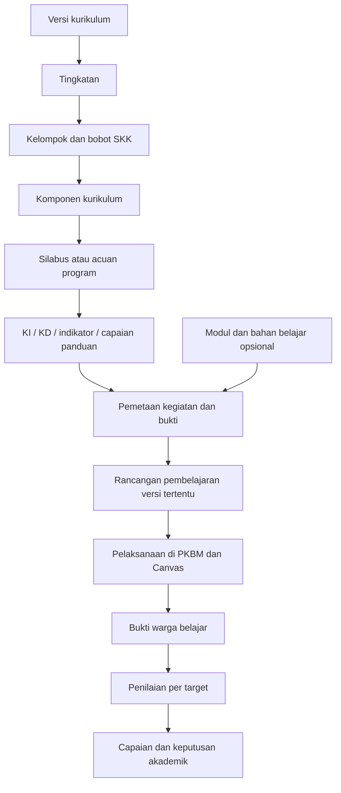

# Struktur database akademik PKBM

Tanggal: 7 Oktober 2026. Status: rancangan logis, belum migrasi atau database terpasang.

## 1. Dasar rancangan

Sesuai arahan pengguna, struktur akademik diturunkan dari kurikulum, silabus, dan panduan muatan pemberdayaan/keterampilan. Modul menjadi bahan dan rancangan pelaksanaan yang dipetakan ke struktur tersebut. Pengembangan database dapat berjalan sebelum katalog semua modul tersedia.

| Kebutuhan | Acuan utama | Peran modul |
|---|---|---|
| Program, tingkatan, kelompok, mata pelajaran dan bobot SKK | KUR-C PDF 5–7, cetak 1–4 | Mengisi bahan pelaksanaan |
| KI dan KD tiap mata pelajaran | Bagian mata pelajaran dalam KUR-C | Dipetakan ke KD yang sesuai |
| Indikator, materi dan kegiatan | SIL-MTK dan SIL-BID; silabus lain saat tersedia | Mengembangkan bahan/kegiatan untuk sebagian cakupan |
| Capaian pemberdayaan | PAN-PEM, area, capaian dan penilaian; PDF 9–15 | Bahan opsional untuk rancangan program |
| Keterampilan wajib/pilihan dan penyelenggaraan | PAN-KET PDF 7–8 dan 12–18 | Bahan teori/praktik, bukan syarat adanya program |
| Aturan khusus latihan/pindah modul | Modul bersangkutan | Berlaku pada lingkupnya, tidak menjadi aturan global |

ID sumber, lokasi, hash dan temuan rinci tersedia pada `pemetaan-sumber-dan-aturan-pkbm.json`. Rujukan ini merupakan telaah dokumen yang diberikan, bukan validasi keberlakuan regulasi terbaru.

Kurikulum memuat KI sikap spiritual, sosial, pengetahuan dan keterampilan. Simpan semua dimensinya. Pada pemberdayaan, panduan memerinci performa pengetahuan, keterampilan dan sikap; jangan mengarang kode KD untuk capaian yang tidak diberi kode dalam panduan.

## 2. Hierarki dan relasi

Komponen meliputi mata pelajaran umum/peminatan, pemberdayaan dan keterampilan wajib/pilihan. Prakarya, Seni Budaya dan Pendidikan Olahraga/Rekreasi dirujuk dari struktur keterampilan wajib dengan hubungan eksplisit, agar tidak dihitung dua kali. Matematika wajib dan peminatan berbeda ID. Tingkatan V/VI merupakan data acuan, sementara tahun/periode dan kelompok merupakan data pelaksanaan.

## 3. Tabel acuan bersama

Acuan bersama hanya dapat diubah pengelola katalog berwenang. PKBM memilih versi acuan dan menyimpan penyesuaian lokal pada rancangan/pelaksanaan, tanpa mengubah sumber bersama.

| Tabel | Kolom utama dan hubungan |
|---|---|
| `source_documents` | UUID, jenis, judul internal, nama file, lokasi berkas, SHA-256, revisi resmi nullable, tanggal metadata terpisah |
| `source_references` | UUID, FK dokumen, halaman PDF awal/akhir, halaman cetak, bagian, teks/ringkasan sumber |
| `curriculum_versions` | UUID, nama, alias, versi resmi nullable, status, FK sumber; tidak otomatis memberi label revisi berdasarkan metadata PDF |
| `curriculum_levels` | UUID, FK versi, kode V/VI, kesetaraan kelas |
| `curriculum_groups` | UUID, FK tingkatan, jenis umum/peminatan/khusus, nama, bobot SKK, FK rujukan |
| `specialization_tracks` | UUID, FK versi, kode/nama peminatan MIA/IPS/Bahasa dan Budaya |
| `curriculum_components` | UUID, FK kelompok, FK peminatan nullable, jenis mapel/pemberdayaan/keterampilan, nama, kode lokal, subjenis wajib/pilihan jika relevan |
| `component_relations` | UUID, FK komponen asal/tujuan, jenis hubungan seperti `keterampilan_wajib_mengacu_mapel`, FK rujukan; hubungan ini tidak menggandakan bobot |
| `academic_frameworks` | UUID, FK komponen, jenis silabus/panduan/standar_program, versi, FK rujukan, status ketersediaan; satu komponen dapat memiliki beberapa acuan |
| `learning_targets` | UUID, FK komponen, jenis KI/KD/indikator/capaian_panduan, dimensi, FK parent nullable, kode sumber nullable, kode tampilan nullable, teks, FK rujukan |
| `framework_targets` | FK acuan dan target, relasi menjabarkan/merujuk, FK rujukan; mempertahankan asal KI/KD di kurikulum dan penjabaran indikator di silabus |
| `framework_topics` | UUID, FK acuan, judul materi, deskripsi, urutan, FK rujukan |
| `framework_activities` | UUID, FK acuan, uraian kegiatan sumber, urutan, FK rujukan |
| `framework_activity_targets` | FK kegiatan sumber dan target; pemetaan banyak-ke-banyak |
| `source_findings` | UUID, FK rujukan, jenis typo/perbedaan_konsep/kekosongan, temuan, interpretasi kerja, status dan riwayat keputusan |

KD menjadi target kanonis dalam konteks kurikulum, tingkatan dan mapel. Salinan rumusan yang berbeda pada silabus disimpan sebagai rujukan/varian, tidak menghapus rumusan asal. Indikator mengacu KD induk. Kode indikator berulang pada SIL-MTK tetap memiliki UUID berbeda; kode asli bukan primary key.

Komponen tanpa silabus tersedia tetap dapat mempunyai KD dari kurikulum. Indikator tidak dibuat sebagai kutipan sumber sampai silabusnya tersedia. Indikator lokal yang diperlukan disimpan dengan asal `rancangan_tutor` dan versi lokal, bukan diberi status indikator nasional.

## 4. Tabel PKBM, warga belajar dan pelaksanaan

Semua tabel lokal memiliki `pkbm_id`. Relasi lokal harus berada di PKBM yang sama; penggunaan UUID saja tidak menjamin batas akses.

| Tabel | Kolom utama dan hubungan |
|---|---|
| `pkbms` | UUID, nama, identitas lembaga nullable, Canvas account reference |
| `people` | UUID, data identitas minimum; akun Canvas dipetakan terpisah |
| `pkbm_memberships` | UUID, FK PKBM/orang, status; unique PKBM+orang |
| `role_assignments` | FK membership, peran pengelola/tutor/instruktur/warga_belajar, lingkup penugasan; orang dapat memegang beberapa peran |
| `program_offerings` | UUID, PKBM, FK versi kurikulum, periode, status |
| `learner_programs` | UUID, PKBM, FK program/membership, tingkatan, peminatan nullable, tanggal dan status |
| `learning_groups` | UUID, PKBM, FK program, nama, periode |
| `group_memberships` | FK kelompok dan learner_program, rentang keanggotaan |
| `learning_plans` | UUID, PKBM, FK learner_program, versi, tanggal, tujuan, status |
| `learning_plan_items` | FK rencana, target/komponen, pelaksanaan yang dipilih nullable, urutan/rencana waktu |
| `partners` | UUID, PKBM, nama, jenis lembaga praktik/sertifikasi/masyarakat, identitas dan kontak seperlunya |
| `learning_design_versions` | UUID, PKBM, jenis mapel/pemberdayaan/keterampilan/terpadu, nama, versi, status, kebutuhan/potensi, mode sertifikasi nullable |
| `design_components` | FK rancangan dan komponen; mendukung program yang merujuk beberapa komponen |
| `learning_activities` | UUID, PKBM, FK rancangan, unit/urutan, tujuan, mode, jenis kegiatan, lokasi praktik bila relevan |
| `activity_targets` | FK kegiatan dan target, sifat landasan/diajarkan/dinilai, status pemetaan, FK rujukan atau temuan |
| `deliveries` | UUID, PKBM, FK rancangan versi, periode, kelompok nullable, lokasi, status |
| `delivery_staff` | FK pelaksanaan dan membership tutor/instruktur, tanggung jawab; bisa dibatasi target yang dinilai |
| `delivery_enrollments` | UUID, PKBM, FK pelaksanaan dan learner_program, tanggal/status |
| `learning_sessions` | UUID, PKBM, FK pelaksanaan/kegiatan, mode tatap_muka/tutorial/mandiri/praktik, tanggal, rencana dan realisasi JP |
| `session_participation` | FK sesi/enrollment, hadir/partisipasi, bukti dan catatan pendampingan |

## 5. Modul sebagai bahan yang dapat ditambahkan

| Tabel | Kolom utama dan hubungan |
|---|---|
| `learning_resources` | UUID, jenis modul_PDF/video/bahan_praktik/lainnya, judul, FK sumber nullable, versi |
| `resource_components` | FK bahan dan komponen; Matematika 1/2 dan Bahasa Indonesia 1 tetap memiliki identitas berbeda |
| `resource_units` | UUID, FK bahan, nomor/judul unit, FK lokasi sumber |
| `resource_target_mappings` | FK bahan/unit dan target, sifat hubungan, alasan, sumber, status; hubungan MTK1 dua variabel tetap bertanda perlu telaah |
| `activity_resources` | FK kegiatan dan bahan/unit, urutan, wajib/opsional |

Rancangan dan kegiatan tidak wajib mempunyai modul. Ini menampung program pemberdayaan/praktik dari panduan dan rencana tutor. Kebijakan lokal dapat menggunakan bahan alternatif untuk mencapai target yang sama. Aturan khusus modul terikat sumber dan versi modul tersebut.

## 6. Penilaian, capaian dan keputusan

| Tabel | Kolom utama dan hubungan |
|---|---|
| `assessment_rule_versions` | UUID, PKBM nullable untuk ketentuan sumber bersama, asal sumber/desain/kebijakan_lokal, lingkup, versi, metode/formula yang dikenali, threshold nullable, maksimum percobaan nullable, FK rujukan |
| `assessment_rule_clauses` | FK aturan, kelompok alternatif, operator AND/OR, jenis bukti/jalur, syarat; formula berupa tipe yang diizinkan beserta parameter, bukan kode bebas untuk dieksekusi |
| `rubric_versions` | UUID, PKBM, nama, versi, status |
| `rubric_criteria` | UUID, FK rubrik, FK target nullable, uraian, skala/rating/bobot, FK rujukan jika ada |
| `assessment_definitions` | UUID, PKBM, FK kegiatan, jenis latihan_mandiri/uji/tugas/observasi/wawancara/praktik, FK aturan/rubrik versi, status |
| `assessment_targets` | FK penilaian dan target; satu penilaian dapat menilai beberapa target |
| `evidence_artifacts` | UUID, PKBM, FK pelaksanaan/kegiatan, jenis tulisan/produk/observasi/refleksi/berkas, referensi berkas/Canvas, waktu, versi, parent revisi nullable |
| `evidence_contributors` | FK bukti dan enrollment, peran kontribusi; mendukung kelompok dan individu |
| `assessment_attempts` | UUID, PKBM, FK definition/enrollment, nomor percobaan, tanggal/status, sumber Canvas/lokal/mitra |
| `attempt_evidence` | FK percobaan dan bukti; banyak bukti per penilaian |
| `assessment_results` | UUID, PKBM, FK percobaan/target/criterion, penilai, nilai/performa, umpan balik, status dan waktu |
| `baseline_observations` | UUID, PKBM, FK enrollment/target, tanggal, instrumen, bukti, kondisi awal; terutama pemberdayaan |
| `achievement_decisions` | UUID, PKBM, FK learner_program/target, status, pengambil keputusan, aturan versi, tanggal; riwayat keputusan dipertahankan |
| `achievement_evidence` | FK keputusan dan hasil penilaian/baseline relevan |
| `academic_decisions` | UUID, PKBM, FK learner_program, komponen/program, jenis lanjut_modul/selesai_program/hasil_mapel, status, versi kebijakan, pelaku, tanggal |
| `credit_allocations` | UUID, PKBM, program, komponen, jumlah SKK, versi kebijakan; pembagian berasal dari PKBM, bukan dibagi rata oleh sistem |
| `credit_decisions` | UUID, PKBM, learner_program, FK alokasi, jumlah diakui, status, pelaku, tanggal, pengganti keputusan nullable |
| `credit_decision_basis` | FK keputusan SKK dan capaian/keputusan akademik yang mendasari |
| `external_certifications` | UUID, PKBM, learner_program, program keterampilan, penerbit, skema, nomor/tanggal/berkas, hasil uji, status verifikasi |
| `audit_events` | PKBM, pelaku, objek, tindakan, waktu, perubahan dan alasan |

Pemberdayaan memakai baseline, perkembangan berkala dan bukti pengetahuan/keterampilan/sikap. Masukan masyarakat/mitra dapat dicatat tanpa memberi mereka hak mengesahkan seluruh hasil. Nilai kelompok tidak otomatis menjadi capaian individu; penilai perlu bukti kontribusi/hasil tiap warga belajar.

Sikap spiritual/sosial menggunakan pengamatan dan bukti sesuai acuan, bukan dibuat otomatis dari persentase login atau penyelesaian kuis. Keterampilan tersertifikasi menyimpan capaian PKBM dan hasil lembaga penerbit secara terpisah.

## 7. Integrasi dan batas kepemilikan data

| Data | Sumber utama |
|---|---|
| Kurikulum, silabus, panduan, target akademik dan pemetaan | Aplikasi PKBM |
| Rencana program, kelompok, peserta dan keputusan akademik | Aplikasi PKBM |
| Course, konten, pengumpulan dan penilaian native | Canvas |
| Salinan hasil Canvas untuk rekap | Aplikasi PKBM, dengan ID/versi asal |
| Bukti lokal/mitra dan penilaian yang dilaksanakan di aplikasi pendamping | Aplikasi PKBM |
| Sertifikat eksternal | Dokumen/hasil penerbit; aplikasi PKBM mencatatnya |

Tabel `canvas_instances`, `canvas_bindings`, `sync_jobs` dan `sync_events` menyimpan instance, pasangan UUID lokal/ID Canvas, versi asal, waktu, status, jumlah percobaan dan error. Unique binding mencakup instance, jenis objek dan ID remote; binding dapat berlingkup PKBM. Akun, Course, Sections, Users, Outcomes, Assignments, Submissions dan Rubrics dipetakan sesuai kebutuhan implementasi.

Sinkronisasi memakai API, tidak menulis langsung ke database Canvas. Publikasi melalui job idempotent; penarikan hasil tidak mengesahkan SKK. Koreksi penilaian Canvas memperbarui salinan dan menandai keputusan terkait untuk ditinjau, tanpa menghapus keputusan terdahulu secara diam-diam. Rekonsiliasi menelusuri hasil yang diubah/dihapus dan menjaga asal/versi.

## 8. Aturan integritas

1. UUID sebagai primary key. Kode KD/indikator bersifat label dalam konteks versi+komponen+parent+lokasi, bukan kunci global.
2. Foreign key komposit PKBM+ID atau pemeriksaan setara menjaga semua relasi lokal dalam lembaga yang sama. Otorisasi dilakukan kembali pada API dan job; PKBM tidak bebas memodifikasi acuan bersama.
3. FK parent target harus berada di versi/komponen yang sesuai. Komponen Tingkatan V dan VI berbeda walau kode KD sama.
4. Referensi kegiatan, target dan rencana penilaian harus konsisten pada snapshot rancangan yang diterapkan. Pemetaan lintas komponen harus eksplisit.
5. Versi yang sudah dipakai pada hasil bersifat immutable; perubahan membuat versi baru. Koreksi hasil mempunyai riwayat dan alasan.
6. Aturan dengan angka/bobot yang tidak tersedia menyimpan null. Sistem tidak menggantinya dengan 70, 75, nol, atau rumus rata-rata.
7. Bobot SKK kelompok dicatat sesuai sumber. Batas alokasi dan pencegahan pengakuan ganda diperiksa berdasarkan kebijakan PKBM yang ditetapkan.
8. Penilaian yang menghasilkan capaian wajib mempunyai target, bukti, penilai dan aturan/rubrik yang berlaku. Bukti minimal dua teks pada KD BId 3.2 dapat diperiksa sebagai ketentuan bukti.
9. Batas percobaan dipasang per penilaian; sekali lagi mengulang TAM BId berbeda dari latihan mandiri dan aturan modul Matematika.
10. Panduan Paket A/B/C difilter pada cakupan Paket C. Jenis sumber dan status ketepatan konsep tetap dipertahankan.

## 9. Data awal dan urutan pengerjaan

1. Daftarkan versi kerja K13 Paket C, dokumen, tingkatan, kelompok, peminatan, komponen dan bobot SKK pada tabel sumber.
2. Masukkan KI/KD dari kurikulum. Tambahkan indikator/materi/kegiatan dari dua silabus yang tersedia; mapel lain berstatus indikator belum tersedia.
3. Masukkan area/capaian Paket C dari panduan pemberdayaan dan struktur keterampilan wajib/pilihan beserta rujukan KD/standar.
4. Tambahkan tiga modul contoh dan pemetaan yang sudah dibuat. Pemetaan bermasalah tetap disimpan sebagai temuan, tanpa mengubah target kurikulum agar mengikuti isi modul.
5. Buat satu PKBM, satu kelompok, dua rancangan mata pelajaran dan pelaksanaannya. Tentukan kegiatan dan penilaian berdasarkan target acuan.
6. Integrasikan Course/Modules/peserta/penilaian Canvas. Rekap target dari hasil; keputusan SKK baru diaktifkan setelah alokasi dan kebijakan tersedia.

Penyusunan skema tidak menunggu telaah semua modul. Telaah dokumen yang tersedia dipakai langsung sebagai dasar rancangan; validasi kegiatan tertentu dilakukan pada titik penerapannya. Ketentuan yang tidak ditetapkan sumber tetap tercatat sebagai parameter lokal yang belum diisi.

## 10. Batas hasil pekerjaan ini

Rancangan tabel dan aturan integritas sudah disusun. Seluruh KI/KD buku belum menjadi seed database, aplikasi belum dibangun, migrasi belum dijalankan, dan Course belum dibuat. Bagian tabel merupakan usulan implementasi teknis berdasarkan isi sumber, bukan nama tabel yang ditetapkan dokumen pendidikan.
