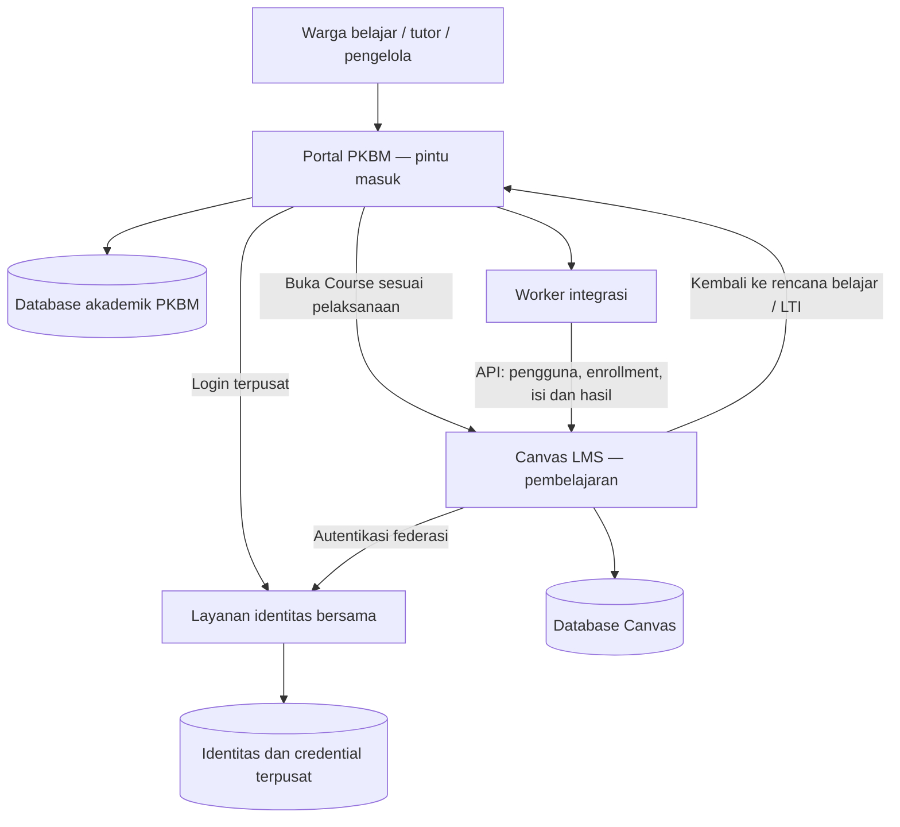

# Tahap 5A — arsitektur identitas dan alur pengguna

Tanggal: 7 Oktober 2026. **Dokumen rancangan; SSO belum diimplementasikan atau diuji.** Dokumen ini memperbarui rancangan login/navigasi pada rangkuman awal. Struktur akademik berbasis kurikulum, silabus, pemberdayaan dan keterampilan tetap menjadi acuan. Tahap 5 sudah membuktikan integrasi API/LTI dalam lingkup laporan pengujiannya; bukti tersebut tidak membuktikan login bersama.

## 1. Keputusan pengalaman pengguna

**Satu orang memiliki satu akun utama dan satu tempat mengatur password. Warga belajar, tutor dan pengelola masuk lewat Portal PKBM, lalu berpindah ke pembelajaran Canvas tanpa memasukkan password kedua.**

| Pertanyaan | Keputusan rancangan |
|---|---|
| Apakah pengguna mendaftar dua kali? | Tidak. Pendaftaran/undangan dilakukan sekali. |
| Apakah pengguna mempunyai dua password? | Tidak. Credential pengguna dikelola layanan identitas bersama. |
| Apakah dua aplikasi masih berjalan? | Ya: Portal PKBM dan Canvas, karena tanggung jawab akademik dan pelaksanaan pembelajaran berbeda. |
| Mengapa ada record pengguna di Canvas? | Canvas memerlukan ID internal untuk enrollment, pekerjaan, nilai dan histori. Record ini ditautkan ke identitas utama dan bukan akun tambahan yang harus diurus pengguna. |
| Apakah layanan identitas menjadi aplikasi ketiga yang harus digunakan WB? | Tidak. Itu layanan pendukung; layar login/aktivasi terpusat menjadi bagian perjalanan pengguna. |
| Apakah SSO menyatukan semua halaman menjadi satu tampilan React? | Tidak dengan sendirinya. Portal menjadi pintu masuk; halaman belajar native Canvas tetap digunakan, dengan navigasi dan konteks yang jelas. |
| Apakah database harus digabung? | Tidak. Database akademik PKBM, Canvas dan penyimpanan layanan identitas mengikuti batas masing-masing. |

Target utama adalah satu pintu masuk dan satu identitas. Identitas terhubung lintas aplikasi; hak akses tetap diperiksa pada setiap aplikasi. SSO yang berhasil tidak otomatis memberi akses ke suatu Course.

## 2. Masalah implementasi sekarang

- Pendamping memeriksa email/password lokal berdasarkan PKBM dan menerbitkan token sesi sendiri.
- Sinkronisasi membuat pengguna Canvas dengan SIS ID dari orang lokal, login berbentuk UUID dan password acak yang tidak disediakan kepada pengguna.
- Browser dapat tetap memiliki sesi akun Canvas demo lama. Tautan Course tidak memastikan sesi itu cocok dengan identitas pendamping.
- Pada insiden WB, Course 3 memakai binding WB DEMO-A ke Canvas user 5, sementara browser memakai pseudonym WB demo lama. Pendamping merespons 200; Canvas menolak Course. Ini bukti insiden yang tercatat, bukan pemetaan semua pengguna saat ini.
- LTI yang tersedia menghubungkan Canvas → pendamping. Ia tidak menyediakan login pendamping → Canvas.

Penyiapan password Canvas kedua tidak dipakai sebagai penyelesaian arsitektur. Pemisahan identitas sekarang perlu dimigrasikan, sehingga tautan biasa tidak lagi membawa pengguna ke sesi Canvas yang keliru.

## 3. Arsitektur target



| Sistem | Sumber utama |
|---|---|
| Layanan identitas | ID orang yang stabil, autentikasi, credential, aktivasi, pemulihan akun dan status identitas |
| Portal PKBM | Membership PKBM, peran, penugasan tutor, enrollment program, rancangan, aturan, capaian/keputusan akademik |
| Canvas | Course/Section, pekerjaan/revisi, submission, quiz, rubric assessment, feedback dan nilai native |
| Worker | Binding, riwayat provisioning, status sinkronisasi, konflik dan retry |

Akun layanan integrasi API terpisah dari akun pengguna. Pengguna tidak diminta membuat token admin Canvas. Credential layanan disimpan oleh deployment secara terlindungi dan dipakai worker dengan kewenangan yang diperlukan; penyediaan credential baru tetap membutuhkan otorisasi tindakan yang sesuai.

### Protokol dan keputusan yang belum final

**Pembaruan implementasi:** provider `open_id_connect.rb` ditemukan pada checkout terkunci. Jalur awal kini OIDC pada kedua aplikasi dengan Keycloak 26.8.0; uraian SAML berikut merupakan rancangan sebelumnya. [Konfigurasi terbaru](tahap5a-oidc-configuration.md). Runtime/provider belum aktif.

Rancangan awal memakai **IdP yang mendukung federasi SAML 2.0 untuk Canvas**. Checkout Canvas lokal memuat `AuthenticationProvider::SAML`, dengan konfigurasi metadata, atribut login, JIT provisioning serta alur login/logout. Acuan source: `vendor/canvas-lms/app/models/authentication_provider/saml.rb` pada versi Canvas terkunci. Ini inspeksi source, bukan bukti koneksi SSO berjalan.

Portal dapat menggunakan OIDC Authorization Code dengan PKCE ke IdP yang sama. Subject OIDC dan identifier SAML ditautkan melalui ID orang stabil yang sama; keduanya tidak diasumsikan identik tanpa konfigurasi pemetaan. Jalur alternatif portal SAML dapat dipilih jika lebih sesuai dengan library/runtime yang tersedia. Tidak menganggap OAuth2 generik pada Canvas sebagai dukungan OIDC generik yang sudah terbukti.

Produk IdP, versi, image, biaya RAM/disk, library portal, metadata/issuer, callback, atribut login dan dukungan logout belum ditetapkan. Pilih setelah inspeksi source, dependensi/cache lokal dan kapasitas aktual. Dokumen ini tidak mengizinkan unduhan, pemasangan layanan atau perubahan konfigurasi autentikasi. URL 3000/8081 masih endpoint pengembangan yang ada, bukan alamat produksi final. Domain/callback/cookie/TLS deployment harus diputuskan dan dibuktikan bersama konfigurasi SSO.

## 4. Model satu identitas

```text
Identitas orang yang stabil
├── Profil pada PKBM A → membership → peran dan penugasan
├── Profil pada PKBM B → membership → peran dan penugasan
└── Record pengguna Canvas pada instance/root terkait
    └── Enrollment Course/Section sesuai masing-masing pelaksanaan
```

Satu orang boleh bergabung pada beberapa PKBM dan mempunyai beberapa peran. Pengguna memilih konteks PKBM setelah autentikasi bila membership aktifnya lebih dari satu. Password tidak dipisahkan berdasarkan PKBM/peran.

`people` saat ini merupakan profil dalam lingkup PKBM. Target menambahkan identitas global dan tautan profil, sehingga profil tenant tidak dipaksa menjadi identitas autentikasi global. Nama, email, PKBM/peran yang dapat berubah bukan kunci pencocokan utama. Akun fixture dua PKBM yang memakai string email sama tidak otomatis berarti orang yang sama.

### Entitas yang direncanakan — belum migrasi

| Entitas | Isi dan batas |
|---|---|
| `identity_accounts` | UUID orang global, status, ID user pada IdP; tidak menyimpan password Canvas/portal kedua |
| `identity_external_subjects` | Provider/issuer, jenis protokol, subject/identifier federasi; pasangan provider + identifier unik dan ditautkan ke satu identity |
| `identity_membership_links` | Identity → profil/membership lokal, dibatasi FK PKBM/profile; satu profil tidak dapat diklaim dua identity aktif |
| `canvas_identity_links` | Identity + deployment/root Canvas → Canvas user ID; unik per deployment/root + identity dan per deployment/root + remote user |
| `identity_migration_events` | Kandidat akun lama, keputusan pencocokan, penelaah, waktu, before/after dan alasan; tidak memuat password atau token |
| Sesi portal | Identity, konteks membership aktif, masa berlaku, versi pencabutan dan status; sesi diperiksa server |

Binding objek Course/Section/enrollment tetap memakai lingkup PKBM. Binding user sekarang berpusat pada profil PKBM; migrasi menambahkan hubungan ke identity agar provisioning dapat memakai kembali user Canvas yang benar. Perubahan `sis_user_id` tidak dilakukan diam-diam, karena ID lama dan histori perlu dilacak.

### Sumber peran dan batas akses

| Peran lokal | Hak Canvas yang diproyeksikan |
|---|---|
| Warga belajar | StudentEnrollment pada Course/Section yang memang diikutinya |
| Tutor/instruktur | TeacherEnrollment atau role pengajar yang dipilih, hanya pada delivery yang ditugaskan |
| Pengelola PKBM | Hak administrasi yang diperlukan pada subaccount PKBM sendiri; bukan Site Admin/root Admin otomatis |
| Admin operasi sistem | Akun operasional terpisah dengan lingkup dan pemulihan yang tercatat; bukan akun pengelola biasa |

Klaim peran dari browser/URL/LTI tidak memberi hak baru. Membership, penugasan dan enrollment merupakan sumber kewenangan lokal yang diproyeksikan ke Canvas. Hak akses hanya dinyatakan siap bila proyeksi Canvas yang diperlukan sudah berhasil; login federasi tidak menyembunyikan kegagalan enrollment.

## 5. Algoritma provisioning dan pencocokan

1. Pengelola mengundang/mendaftarkan pengguna sekali pada konteks PKBM dan memberi peran yang sesuai.
2. Tentukan identity global melalui identifier yang telah diverifikasi. Jika belum ada, buat satu identity dan aktivasi pada IdP; jangan membuat identity hanya berdasarkan nama/email yang mirip.
3. Simpan tautan identity → membership lokal. Catat status `pending` sampai proses aktivasi/otorisasi selesai.
4. Worker memperoleh lock per identity dan deployment/root Canvas.
5. Jika `canvas_identity_links` sudah ada, periksa user remote masih ada dan identifier/login federasi cocok. Jika hilang/bertentangan, tandai konflik; jangan membuat pengganti otomatis.
6. Jika tautan belum ada, cari kandidat dengan identifier federasi/SIS/integration ID yang stabil dan tervalidasi. Satu kandidat yang cocok dapat ditautkan. Beberapa kandidat atau identitas yang sudah dimiliki identity lain wajib ditelaah.
7. Jika tidak ada kandidat, provision satu user Canvas via API dan pasang login federasinya pada authentication provider yang tepat. Pengguna tidak menerima password Canvas kedua. Nonaktifkan JIT auto-create sampai pencocokan dan kontrol tenant terbukti; jika diaktifkan kemudian, tetap gunakan kunci yang sama dan kontrol keunikan.
8. Catat tautan identity/Canvas dan identifier lama/baru dalam audit. Lanjutkan provisioning enrollment sesuai membership/penugasan, tanpa mengubah enrollment yang tidak dimiliki integrasi.
9. Tandai akses pembelajaran `ready` hanya setelah mapping user, provider login, Course/Section dan enrollment sesuai.
10. Retry memakai identity/link yang sama. Ketika hasil POST remote tidak diketahui, cari kembali identifier sebelum mengirim POST berikutnya.

Status yang ditampilkan ke pengguna: **aktivasi akun**, **akses pembelajaran sedang disiapkan**, **siap belajar**, atau **perlu bantuan pengelola**. Pesan tidak memaparkan token/UUID internal/stack trace dan tidak meminta pengguna membuat akun Canvas lain.

## 6. Alur pengguna

### Warga belajar

1. Buka Portal PKBM dan pilih **Masuk**.
2. Login/aktivasi di layanan identitas bersama; kembali ke portal.
3. Bila perlu, pilih PKBM dari membership aktif yang sudah dimiliki.
4. Lihat rencana belajar, kegiatan berikutnya, status prasyarat dan umpan balik.
5. Pilih **Mulai belajar**. Server memeriksa membership/enrollment dan akses `ready`, lalu membuka Course/item Canvas dengan identitas federasi yang sama.
6. Jika belum ada sesi Canvas, Canvas melakukan redirect ke IdP; sesi IdP yang masih valid menyelesaikannya tanpa password kedua.
7. Kerjakan materi/tugas/kuis, kumpulkan bukti dan revisi. Gunakan **Kembali ke rencana belajar** untuk kembali ke portal.
8. Pilih **Keluar dari pembelajaran** untuk mengakhiri sesi sesuai kontrak logout bersama.

Akses Course langsung juga harus memakai provider identitas yang sama. Canvas tidak boleh diam-diam memakai akun demo lama milik orang lain. Jika sesi lama berbeda, batalkan perpindahan otomatis dan minta pengguna menyelesaikan pergantian sesi lewat alur yang jelas; jangan memakai admin masquerade sebagai login WB.

### Tutor/instruktur

Login yang sama → pilih PKBM → pilih kelompok/delivery yang ditugaskan → telaah rancangan dan instrumen → buka ruang pembelajaran → nilai bukti dengan identitas pengajar sendiri → beri feedback/tindak lanjut → kembali ke daftar pendampingan. Perubahan peran atau PKBM mengubah konteks dan kewenangan, bukan membuat akun baru.

### Pengelola PKBM

Login yang sama → kelola undangan/membership/peran → program, kelompok dan penugasan → telaah kesiapan akses pengguna → tangani konflik provisioning → lihat rekap PKBM. Pengelola tidak mengatur password Canvas terpisah atau menggunakan root Admin untuk pekerjaan akademik rutin.

### Pemulihan dan keluar

- **Lupa password:** satu alur pemulihan pada IdP; tidak ada dua formulir reset password pengguna.
- **Membership satu PKBM dinonaktifkan:** akses tenant tersebut dicabut dan enrollment milik integrasi dinonaktifkan; akses ke PKBM lain yang sah tetap ada.
- **Identity global dinonaktifkan:** login baru ditolak, sesi portal dicabut dan sesi Canvas/IdP harus diputus sesuai kemampuan yang diuji. Proyeksi enrollment juga diperbarui.
- **Logout bersama:** tutup sesi portal, IdP dan Canvas melalui mekanisme yang didukung. Penghapusan token browser portal saja tidak dianggap logout bersama. Dukungan SLO masing-masing sisi, browser multi-tab dan batas waktu pencabutan wajib dibuktikan. Jika logout salah satu sisi gagal, tampilkan keadaan yang jujur dan jangan klaim pengguna sudah keluar dari semuanya.
- **IdP atau worker gagal:** tampilkan gangguan/akses menunggu; jangan membuat akun/password sementara secara otomatis.

## 7. Navigasi aplikasi

Portal menjadi titik masuk resmi; pengguna biasa tidak perlu memilih port/aplikasi. Tautan **Mulai belajar** diarahkan melalui route server yang direncanakan, misalnya `/belajar/:delivery_id`, bukan langsung mengasumsikan sesi Canvas cocok. Route tersebut **belum tersedia**.

Canvas menyediakan tautan kembali ke portal pada konteks yang benar. LTI dapat menjaga konteks Course/pengguna saat kembali, tetapi identitas hasil LTI tetap harus cocok dengan identity utama. Relasi LTI menggunakan binding identity dan tenant, bukan membuat sesi bagi identity lain hanya karena suatu role diklaim.

Materi, Assignment, Quiz dan pekerjaan native tetap berada di Canvas; portal memegang rencana dan rekap. Tampilan native Canvas dapat masih terlihat berbeda. Penamaan, tautan masuk/kembali dan petunjuk alur harus konsisten; iframe tidak menjadi syarat dan tidak dipakai sebagai solusi autentikasi.

## 8. Migrasi akun lama tanpa kehilangan hasil

1. Inventarisasi hanya metadata identity/profile, user/login Canvas, bindings, membership, enrollment dan kepemilikan hasil yang relevan. Simpan snapshot/backup sebelum perubahan yang memengaruhi pengguna.
2. Pisahkan fixture demo dari pengguna nyata. WB demo lama tidak otomatis dipetakan ke WB DEMO-A hanya karena namanya sama.
3. Siapkan daftar kandidat dan keputusan: pakai kembali akun yang benar, pasang provider federasi pada akun terikat, atau konflik yang perlu telaah pengelola.
4. Pada DEMO-A, Canvas user 5 sudah menjadi user terikat pada Course 3. Jadikan kandidat utama untuk identity WB DEMO-A setelah verifikasi; jangan membuat user ketiga. User demo lama tetap mempertahankan enrollment/hasilnya sampai ada keputusan eksplisit.
5. Pasang federasi pada user yang dipilih lewat API/config Canvas yang didukung. Tidak menyalin password/hash ke aplikasi kedua dan tidak menulis tabel Canvas langsung dari pendamping.
6. Uji login/peran dan hasil lama sebelum cutover. Ganti tautan portal dengan alur yang memastikan identitas sesi cocok.
7. Matikan login lokal biasa setelah SSO terbukti dan akses pemulihan operasional tersedia. Jangan menghapus user/login lama atau menggabungkan histori secara otomatis.
8. Jika gagal, pulihkan konfigurasi auth/tautan sebelumnya dan pertahankan audit, mapping baru serta pekerjaan yang terlanjur dibuat untuk ditelaah. Rollback bukan penghapusan hasil belajar atau pembuatan password pengguna kedua sebagai pengalaman normal.

Tidak ada credential yang diubah, user yang digabung/dihapus, atau session yang diputus oleh pekerjaan dokumentasi ini.

## 9. Urutan implementasi Tahap 5A

| Bagian | Hasil yang harus disediakan |
|---|---|
| 5A.1 — keputusan teknis | IdP/protokol/versi/dependensi, kebutuhan resource, endpoint/callback, deployment lokal dan kontrak logout yang dapat dijalankan |
| 5A.2 — model identitas | Migrasi tautan identity/profil/provider/Canvas, constraint, audit dan daftar kandidat akun lama |
| 5A.3 — login portal | Aktivasi/login/pemulihan terpusat, sesi server, pilihan konteks PKBM dan pemeriksaan membership |
| 5A.4 — federasi Canvas | Provider Canvas, mapping identifier, provisioning idempotent tanpa password pengguna kedua, enrollment sesuai lingkup |
| 5A.5 — perjalanan pengguna | Masuk dari portal/Canvas, pindah/kembali tanpa login kedua, kesesuaian sesi dan alur logout |
| 5A.6 — migrasi dan bukti | Cutover fixture lama yang ditelaah, hasil/enrollment terjaga, bukti API/browser/peran, rollback dan status gerbang |

Implementasi awal Tahap 6 tetap disimpan. Pengujian end-to-end dan klaim siap dipakai oleh warga belajar menunggu gerbang 5A, termasuk credential layanan integrasi untuk publikasi/penilaian Tahap 6. Infrastruktur baru dan credential akan disiapkan pada tindakan implementasi yang memang diotorisasi; dokumentasi tidak menjalankannya.

## 10. Kriteria penerimaan dan rencana pengujian

Belum ada pengujian Tahap 5A yang dijalankan. Saat pengguna meminta pengujian, bukti harus mencakup:

- [ ] WB, tutor dan pengelola mengaktifkan/login satu akun; tidak ada password Canvas kedua.
- [ ] Login sekali di portal lalu membuka Course/item Canvas dengan user ID yang tepat.
- [ ] Canvas → portal dan akses langsung Canvas menggunakan identity/konteks yang sesuai.
- [ ] Sesi Canvas demo lama yang berbeda tidak memberi akses salah atau membuat loop login.
- [ ] Retry login/provisioning dan worker paralel tidak menggandakan identity, login atau user Canvas.
- [ ] Dua PKBM memakai email/nama yang sama sebagai fixture tetapi tetap terpisah sampai identitas sama dibuktikan.
- [ ] Satu identity yang sah dalam dua PKBM memakai satu credential, dengan enrollment/peran tenant tetap benar.
- [ ] Perubahan peran/penugasan tidak membuka Course atau administrasi di luar kewenangan.
- [ ] Membership/identity nonaktif dan pencabutan sesi berlaku sesuai waktu yang dicatat; akses lama tidak dianggap otomatis aman hanya karena login baru ditolak.
- [ ] Logout diuji pada kedua aplikasi, sesi IdP, multi-tab dan browser back; keadaan gagal ditampilkan jujur.
- [ ] Pemulihan password berfungsi pada satu tempat, tanpa kebocoran token/credential di URL, API/log atau repo.
- [ ] Callback/assertion bertanda tangan divalidasi; issuer/audience/destination/expiry/replay dan redirect di luar tujuan yang diizinkan ditolak.
- [ ] Enrollment, pekerjaan, nilai serta histori akun lama yang dipertahankan tidak hilang.
- [ ] Gangguan IdP/worker dan rollback menghasilkan status yang jelas tanpa akun/password tambahan otomatis.

**Gerbang Tahap 5A:** satu akun dan satu kali login terbukti di browser pada kedua aplikasi, identity/user/peran benar, migrasi fixture terlacak serta logout/pencabutan sesuai kontrak yang dibuktikan. Kelayakan produksi memerlukan bukti deploymentnya sendiri. Dokumentasi atau keberadaan konfigurasi belum memenuhi gerbang ini.
